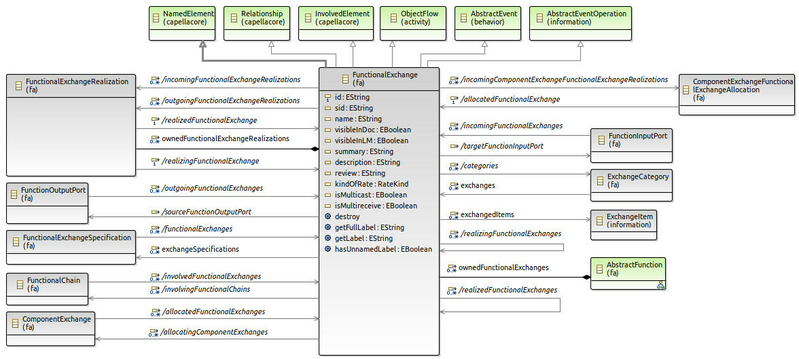
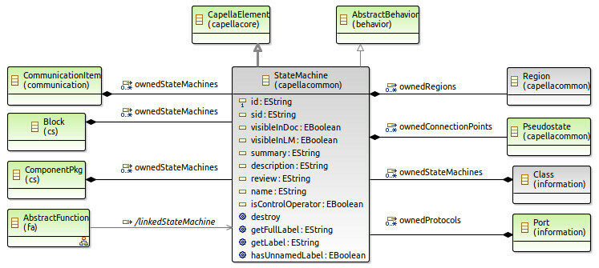
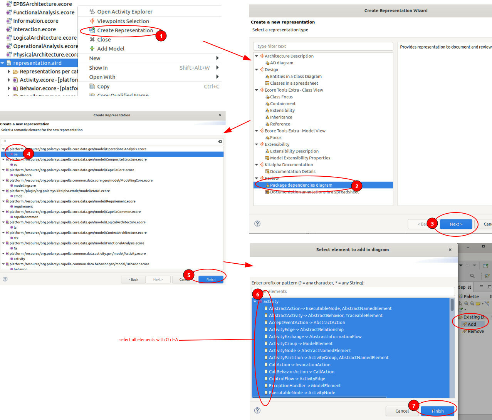

..
   SPDX-FileCopyrightText: Copyright DB Netz AG and the capellambse contributors
   SPDX-License-Identifier: Apache-2.0

*********************************
How to explore Capella meta-model
*********************************

Initially the API design was mostly based on our understanding of XML files,
however we soon moved on into exploring the Capella meta-model. Here is a short
summary of how we do it.

Getting the meta-model sources
##############################

First of all we need to get the data - the most straight-forward way is to
clone the Capella source code:

.. code-block:: bash

    mkdir capella-mm && cd capella-mm
    git clone https://github.com/eclipse/capella.git

As there are quite a few files we may want to discover the packages of interest
using ``find``:

- ``find -name '*.ecore' -o -name '*.genmodel'`` lists all the ECore models and
  Generation files and adds Generation viewpoint for related ecore
- ``find -name '*.odesign'`` lists all the Sirius definitions (if you like to
  see how the diagram look-and-feel is defined)

You could open all the related projects right where they are but I'd prefer to
have a clean sandbox.

.. code-block:: bash

    mkdir capella-metamodel
    cp -r capella/common/plugins/org.polarsys.capella.common.data.activity.gen capella-metamodel
    cp -r capella/common/plugins/org.polarsys.capella.common.data.behavior.gen capella-metamodel
    cp -r capella/common/plugins/org.polarsys.capella.common.data.core.gen capella-metamodel
    cp -r capella/common/plugins/org.polarsys.capella.common.libraries.gen capella-metamodel
    cp -r capella/common/plugins/org.polarsys.capella.common.re.gen capella-metamodel
    cp -r capella/core/plugins/org.polarsys.capella.core.data.gen capella-metamodel
    cp -r capella/releng/cdo/plugins/org.polarsys.kitalpha.emde.model.cdo capella-metamodel
    cp -r capella/tests/plugins/org.polarsys.capella.test.diagram.layout.ju capella-metamodel

Now we have all of the meta-model dependencies in one place and can open it as
a single Eclipse project. You could open those with any Eclipse that has EMF
(like the Modeling bundle) but I'd advise using `Capella Studio`__ (open the
link and search for "Studio") for the best experience - it is provisioned with
all the extras that help you visualize / review the meta-model.

__ https://www.eclipse.org/capella/download.html

.. image:: ../_static/img/2021-05-09_10-36.jpg

After import Eclipse may highlight some projects with error or warning sign -
that's fine, we'll let it go for now.

Before we dive into visualizations, let's have a quick look around. The core of
Capella metamodel is provided by ``org.polarsys.capella.common.data.core.gen``
project. There you'll find the definitions of the "Capella Layers" and the
enabling "EnginereengConcerns" components. For example, the ``SystemAnalysis``
is provided by ``ContextArchitecture.ecore``.

Even though the default tree-view (triggered by double-click on a ``.core``) is
already giving us something there are much better ways to review the models.
We'll talk about that in the `Visualizing ECores`__ chapter. But first we
should have a look into the package structure and interdependencies.

__ #visualizing-ecores

Quick intro to package structure
################################

If you are unfamiliar with ECore you might be wondering what are those ECore
files anyways. We could say that they act as UML Packages. Every package
contains ontology elements (or UML Classes) and "local" element relationships
(Associations). The packages depend on each-other as elements frequently build
on top of each-other via Generalization relationship. Thats one of the best
things about Capella metamodel - it is defined by UML (or well, structural
subset, but still pretty cool)!

So, from using Capella we know our model layers - Operational Analysis, System
Analysis, Logical Architecture, Physical Architecture and EPBS. We can locate
the corresponding ECores pretty quick, but what are all the other packages
about? To answer that question we should visualize the package dependency - the
quickest way to do so is to `create a new representation file`__. And after
that follow the steps in `create package dependency overview`__. The result may
look like what we have below:

__ #create-new-representations-file
__ #package-dependency-overview

.. image:: ../_static/img/2021-05-09_17-38.jpg

And even though there are not too many packages in the meta-model, when we
visualize the inter-package dependency it may be a bit difficult to understand.
By the way, the figure above `is also available in SVG`__ - you can open it in
a new tab and zoom-in if you like or scroll down for a simplified one (but
opinionated).

__ core-pkg-deps-raw.svg

It almost feels like everything depends on everything but that isn't true
really. We could change perspective and look for the dependencies of an
end-user exposed package, such as Operational Analysis (oa). I'll use Papyrus
to visualize that:

.. image:: ../_static/img/2021-05-09_17-44.jpg

When we add all the Capella layers to that picture things get a bit more
interesting. I added some artificial grouping on top of the existing packages
that will help us later on - the artificial groups are: ``CapellaLayers`` -
packages that cover the layers we used to see in the tool; ``CrossLayer`` -
packages that define ontology and patterns that we see in almost every layer;
``Enablers`` - the low level ontology that enables every element.

.. image:: ../_static/img/2021-05-09_21-21.jpg

To make a further point on ``CrossLayer``, lets have a closer look at a
Function. We know that Functions are quite similar in how they look and feel
across Capella layers and have a lot in common with OperationalActivity. When
we open ``LogicalArchitecture.ecore`` we see it defines a ``LogicalFunction``
as a specialization of ``AbstractFunction`` that comes from
``FunctionalAnalysis.ecore``. There is a very nice feature provided by the
`Ecore Tools`__ (that is also included in Capella Studio) - Class Inheritance
view (there is also a tiny `how-to use it below`__). We'll use that to
visualize the way the functions are made.

__ https://www.eclipse.org/ecoretools/overview.html
__ #

Just to be on a safe side I've done the above exercise for
``OperationalActivity``, ``SystemFunction``, ``LogicalFunction`` and
``PhysicalFunction`` - the inheritance tree is exactly the same. I've done this
check for a few other familiar ontology elements and got same result. I think
this gives a feeling for what the ``CrossLayer`` is about - to me that's the
place where most of the magic happens. And this is how the relationship between
the ``CapellaLayers`` and ``CrossLayer`` looks like when we de-noise it a bit:

.. image:: ../_static/img/2021-05-09_22-39.jpg

It's been a lengthy chain of thought and to finish on a hopefully useful
visualization - lets have a look at the Class contexts of some things that we
use most frequently

Visualizations of some frequently used ontology elements
########################################################

Below you'll find some quick visualizations for frequently used ontology
elements, grouped by CrossLayer package

Functional Analysis
*******************

.. image:: ../_static/img/2021-05-10_22-35.jpg

State Machines
**************

.. image:: ../_static/img/2021-05-13_20-46.jpg

The figure above is somewhat a "treasure map" to everything related to state
machines. It is made in a semi-automatic way with the help of ECore Tools and
ELK

Composite Structure
*******************

.. image:: ../_static/img/2021-05-12_18-51.jpg

You may also want to have a look at the Block context below as it defines some
other useful things that a Component (or LogicalComponent) can do.

.. image:: ../_static/img/2021-05-12_19-12.jpg

Appendix: Visualizing ECores
############################

If you are new to CapellaStudio and Ecore, here are some practical hints for
how to get stuff done, ignore the below otherwise:

Create new representations file
*******************************

To start playing with visualizations we need a new representations file
(.aird). It is pretty easy to get there but just in case, there is figure below
to guide you through that.

.. image:: ../_static/img/2021-05-09_17-36.jpg

Package dependency overview
***************************

To create a package dependency overview for all packages you may follow the
guidance in the figure below:

Visualizing class inheritance
*****************************

There is a very nice feature that allows given a class to show all of its
super-classes (generalizations) and specializations. The figure below gives you
some hints for how to use it:

